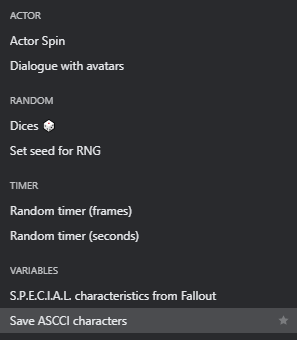

# CompactEvents
A plugin to [GBStudio](https://www.gbstudio.dev/)!


## What's the CompactEvents plugin?
This is a plugin to compact some repetitive scripts, just this.

Here is some examples:



> [!NOTE]
> This is the first version of this plugin, updates coming soon...

## Download
You can download this plugin in the itch.io or in releases.

After downloading the plugin, put it in the plugins folder, like this:
```
📁 GameProject
└ 📁 assets
└ 📂 plugins
  └ 📂 Extract_here
```
